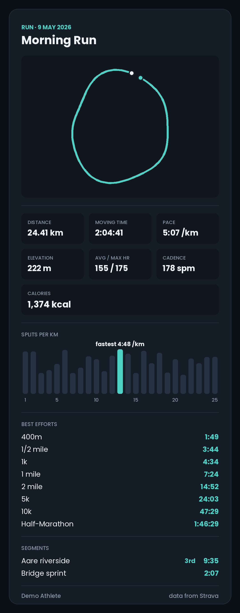

# Activity Wrapped

A configurable year-in-review card for your training, built on the Strava API.

Connect your account, choose the period, the sports and the stats you care about, and download the result as a shareable PNG. You can also open any single activity as its own card, with its route, splits, best efforts and segments, and track how your personal bests have improved. A built-in demo athlete lets you try everything without a Strava account.

<p>
  
  
</p>

*The demo athlete's last 12 months, and one of their long runs. Every year-card section can be switched on or off, and both cards resize to fit.*

## Four views

**Wrapped card.** Your chosen period and sports as one shareable card, built from the sections you pick.

**Activities.** Every activity in the current selection, searchable and sortable by date, distance, time or climbing. Opening one gives an activity card with the route map, distance, time, pace or speed, elevation, heart rate, power, cadence and calories (whichever the activity has), a splits chart with the fastest split marked, the best efforts recorded in it with Strava's PR ranks, and its segment efforts, PR-ranked ones first.

**Training.** An analysis of your running, cycling, swimming or hiking, with findings and advice, charts, race predictions and a training plan with a projection of where it could take you (details below).

**Personal bests.** Your fastest time at each best-effort distance (400 m up to marathon) in the current selection, linked to the run it came from, with how many times you improved it and where you started from.

## What you can choose

| Option | Choices |
| --- | --- |
| Period | Last 12 months, any calendar year with activities, or all time |
| Sports | All, or any combination of the sports in your account (Run, Trail Run, Ride, Swim, Hike, ...) |
| Units | Metric or imperial |
| Theme | Midnight, Paper, Forest, Dusk |
| Map background | None, Streets, Light or Dark |
| Card background | Solid, or Clear (a transparent PNG to lay over your own photo) |
| Map privacy | Hide 200 m, 500 m or 1 km at the start and end of every route, or off |
| Sections | Any of the 15 below |

**Sections:** total distance; moving time, elevation and active days; breakdown by sport; distance by month (or by year for all time); a map of all your routes; best efforts (named PRs such as 5k and Half-Marathon); average pace or speed for the main sport; Eddington number; longest streak; favourite day and time; longest activity; biggest climb; achievement and PR counts; busiest month; most repeated activity name.

## Quickstart

```bash
git clone https://github.com/John-Amal/activity-wrapped.git && cd activity-wrapped
python -m venv .venv && source .venv/bin/activate
pip install -e ".[dev]"
uvicorn activity_wrapped.app:app --reload
```

Open http://localhost:8000 and choose **Try the demo**. No credentials needed.

### Connecting your own Strava account

1. Create an API application at https://www.strava.com/settings/api with **Website** `http://localhost:8000` and **Authorization Callback Domain** `localhost`.
2. `cp .env.example .env` and paste in the Client ID and Client Secret.
3. Restart the server and choose **Connect with Strava**.

### Troubleshooting the login

- **"That login couldn't be completed"**: sessions are kept in memory, so a server restart while you are on Strava's page (for example `--reload` picking up a file change) loses the login. Connect again.
- **Login keeps failing**: make sure `BASE_URL` matches your Strava app's Authorization Callback Domain, and keep `COOKIE_SECURE=false` when serving over plain http. The app moves you from `127.0.0.1` to `BASE_URL`'s host before logging in, because the session cookie only exists on the host where it was set.

## Training intelligence

The Training tab analyses one sport group at a time (running, cycling, swimming, hiking and walking, or everything together) from your whole history.

**What it shows**

- **Key numbers:** weekly volume, fitness, fatigue, form, the recent load ratio, and your thresholds: critical speed for running, estimated threshold power for cycling, maximum heart rate from your own data.
- **Findings with advice,** each with the evidence behind it: whether performance is improving, stable or slipping (with a confidence interval); load spikes; heavy fatigue; whether your current training is enough to hold your fitness, and how many hours would be; volume jumps or drops; easy/hard balance; a long run that carries too much of the week; aerobic efficiency on easy runs; consistency; and PRs that look within reach.
- **Race predictions** for 5k to marathon with ranges, next to your current bests.
- **Pace zones** from your critical speed.
- **Charts:** weekly volume and load, fitness/fatigue/form, monthly performance, time by intensity, aerobic efficiency.
- **A training plan** for a goal (maintain, build endurance, get faster) and optional race date, as a week-by-week table you can add to your calendar (.ics), plus a **projection** of your performance at the end of it.

**How the numbers are made**

Everything uses established, documented models, so each number can be explained:

| Quantity | Method |
| --- | --- |
| Training load | Hours × intensity² × 100 (an hour at threshold scores 100). Intensity comes from power vs. threshold power, pace vs. critical speed, heart rate vs. 88% of max, or a sport default, in that order of preference. |
| Fitness, fatigue, form | 42- and 7-day exponentially weighted load; form is yesterday's fitness minus fatigue. |
| Load ratio | 7- and 28-day EWMA acute:chronic ratio, reported in bands. The evidence on exact injury thresholds is debated, so it is a prompt, not a verdict. |
| Critical speed | D = CS · t + D′ fitted to your fastest recent efforts of 2–40 minutes, one per duration band, so easy runs don't drag it down. |
| Hills | Runs are compared on flat-equivalent distance: each metre climbed counts as 4 m. |
| Race predictions | Riegel's formula from your three strongest recent performances; the spread is the range. |
| Monthly performance | Running: best equivalent-10k pace. Cycling: best weighted power (or high-percentile speed on flat rides without power). Swimming: best pace. Hiking: climbing rate. |
| Trends | Least-squares slope over the last 12 months with a bootstrap 95% interval; "improving" is only claimed when the interval excludes zero. |
| Max heart rate | 98th percentile of your recorded maxima. No age formulas. |

**Plans are deliberately conservative.** They start from your median week of the last four. Build weeks grow 5–8%, every fourth week is a recovery week, and the peak is capped. A plan won't build on top of a load spike, and it tapers into a race. Hard sessions are kept apart and never fall the day before the long one. Your long session goes on the weekday you usually do it. The plan warns when your volume can't yet support the long runs a half or full marathon needs.

**Projections show three scenarios with 80% ranges,** all anchored on your best performance of the last 90 days:

1. *Following the plan* and 2. *keeping your current load* come from a regression of your monthly performance on your monthly fitness, fitted to your own history and bootstrapped. Planned sessions are calibrated so a plan week at your starting volume scores what your recent weeks actually scored. Fitness is clamped to just beyond the range in your history, so the model is never used far outside its data.
3. *If your 12-month trend continues.*

If your history can't support a load-based projection (fewer than 6 comparable months, too little variation in load, or no clear link between load and performance), the app says so and shows the trend only. The projection only knows overall training load, not the plan's structure, so treat it as a cautious floor rather than a promise.

This is a training aid built on your own data, not medical advice. Pain, illness or unusual fatigue overrides any plan.

## Design decisions

**One API pull, then everything is local.** The app fetches your activity list once per session and does all filtering by period and sport in memory. Changing any option re-renders the card without another API call.

**Best efforts are scanned on demand, fastest runs first.** Strava's summary data only has a combined achievement counter. Named PRs (fastest 5k, 10k, ...) sit in each run's detail record, which costs one API call per run against limits of a few hundred requests per 15 minutes. Scanning is therefore a deliberate button press. Runs are scanned in order of average speed, because fast runs are the most likely to contain the period's best efforts, so most PRs turn up within a small call budget. The scan stops before the rate limit runs out (it reads Strava's rate-limit headers), and pressing it again continues where it stopped. Fetched details are cached on disk (efforts, splits, segments and summary metrics only), and opening an activity uses the same cache, so each activity costs at most one call ever. The cache is versioned, so adding fields later refetches cleanly instead of reading incomplete records.

**Routes cost no extra API calls, and the street map is optional.** Every activity in the list comes with a simplified route (Strava's summary polyline), so drawing routes needs nothing more from Strava. By default routes are drawn on a plain panel. Choosing a map background (Streets from OpenStreetMap, or Light or Dark from CARTO) puts them on real street maps. Routes and tiles share one Web Mercator projection, so a route lands exactly on the streets it followed; a test checks this pixel by pixel. Tiles are cached on disk and in memory, because every option change re-renders the card, and fetching the same tiles each time would be slow and against the providers' usage policies. If tiles can't be loaded, the card falls back to the plain panel instead of failing.

**Privacy is on by default.** Most activities start and finish at home, so every route drawn has its first and last 200 m removed by default (adjustable, or off). With a street map behind the route, the area around the start becomes recognisable, so the app suggests 500 m or more when a map is on. For the combined map of all routes this is not enough: routes funnel through your own streets, so the busiest point of an overlay sits near home even when each route is trimmed. The combined map therefore always hides at least 1 km unless privacy is switched off. Routes are never written to disk; the detail cache holds only efforts, splits, segments and summary metrics.

**Clear cards are real transparent PNGs.** The page and card fills are dropped, and panels and dividers become translucent so a photo shows through while numbers stay readable. Text keeps the theme's colours: the light-text themes suit dark photos, and Paper suits light ones. The preview shows clear cards over a checkerboard.

**The combined map shows your main area.** One holiday run would otherwise shrink every other route to a dot. Start points are binned on a coarse grid, the busiest cell is taken as the main area, and only routes starting within 25 km of it are drawn. The card says how many routes that leaves out.

**Personal bests show their history.** Each best is listed with every earlier effort that beat the previous best, so you can see how many times you improved it and where you started.

**The card says what it doesn't know.** If only some runs have been scanned, the best-efforts section shows "from 60 of 197 runs scanned" rather than presenting a partial result as complete.

**Pace and speed are reported per sport, never averaged across sports.** An average speed over runs, rides and swims together is not a meaningful number. Runs, walks and hikes get pace per km or mile, swims get pace per 100 m or 100 yd, and everything else gets speed.

**"Last 12 months" means the current month and the 11 before it,** not the last 365 days. That way the monthly chart and the totals always cover exactly the same activities, and the bars add up to the headline number. A test checks this.

**The preview is the PNG.** The browser displays the server-rendered image itself, so the preview and the download can never drift apart, and the section vocabulary is defined once in `render.py`.

**Tokens stay on the server.** The browser holds only an opaque HttpOnly session cookie. The OAuth flow uses a `state` parameter against CSRF, and access tokens are refreshed automatically when they expire.

## How the statistics are defined

- **Eddington number:** the largest E such that you have at least E days with E km (or miles) or more. Days with several activities are summed. The number depends on the unit, so it changes when you switch units.
- **Longest streak:** the longest run of consecutive calendar days with at least one activity, in local time.
- **Favourite time:** the most common start-time bucket (early morning, morning, midday, afternoon, evening, night), in local time.
- **Achievements and PRs set:** sums of Strava's own `achievement_count` and `pr_count` per activity.

## Project structure

```
src/activity_wrapped/
├── app.py        FastAPI routes: OAuth, data API, card endpoint, static frontend
├── strava.py     API client: token refresh, pagination, rate limits, detail cache
├── stats.py      Pure functions: filtering, statistics, personal bests, activity details
├── routes.py     Polyline decoding, privacy trimming, main-area selection
├── tiles.py      Web Mercator projection, map tile fetching, caching and stitching
├── training.py   Load, fitness/fatigue, critical speed, predictions, trends, intensity
├── planner.py    Rule-based training plans and .ics export
├── forecast.py   Trend and load-based projections with bootstrap ranges
├── insights.py   The training report: findings, advice, chart data
├── render.py     Pillow card renderer, sections and themes
├── demo.py       Seeded synthetic athlete with the same interface as the client
├── sessions.py   In-memory session store
├── static/       Frontend (plain HTML, CSS and JavaScript, no build step; Chart.js vendored)
└── fonts/        Poppins (SIL Open Font License)
tests/            pytest: known-answer tests for the models (critical speed, Riegel, fitness curves,
                  trends, projections), plan rules, tile alignment, rendering, end-to-end API
```

## Development

```bash
ruff check . && pytest
```

CI runs both on Python 3.10 and 3.12. The statistics tests use small hand-built activity lists with known answers. The API tests run the whole flow (connect, filter, scan, render, download) against the demo athlete.

## Limitations

- Sessions are kept in memory, so they are lost on restart and don't work across several server processes. A deployment beyond one instance would need Redis or a database.
- Best efforts exist only for runs, because that is all Strava provides.
- Map tiles come from OpenStreetMap and CARTO, whose free tiles are for light, non-commercial use with attribution (added to every map automatically). For anything with real traffic, switch to a paid tile provider in `tiles.py`, or set `MAP_TILES=false` to turn maps off and make no tile requests at all. The tests never touch the network.
- Route maps use Strava's simplified summary polyline, which is accurate enough for a card but smooths tight corners. Pool swims and indoor activities have no route.
- Personal bests and their history only cover runs that have been scanned; the Personal bests view says how many that is.
- Elevation and distance come from Strava's summary data as recorded; the app does no GPS cleaning.
- Times are bucketed in each activity's local time, so travel across time zones is handled per activity rather than per athlete.

## Strava

This project uses the Strava API but is not affiliated with or endorsed by Strava. Please follow the [Strava API Agreement](https://www.strava.com/legal/api) and brand guidelines if you deploy it.

## Licence

MIT. The bundled Poppins font is under the SIL Open Font License (see `src/activity_wrapped/fonts/OFL.txt`), and the vendored Chart.js is MIT-licensed (see `static/vendor/CHARTJS_LICENSE.md`).
