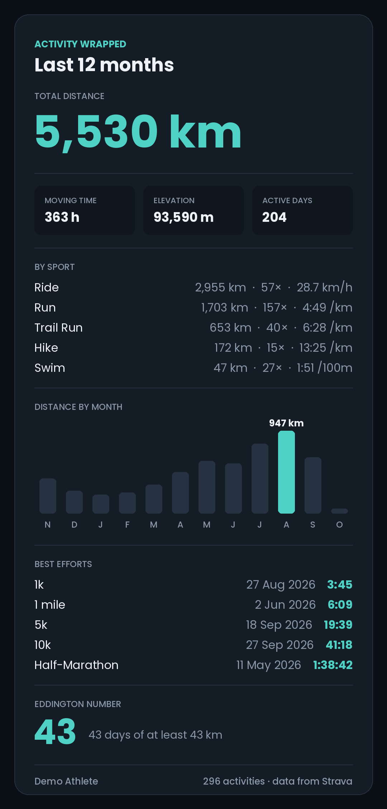

# Activity Wrapped

A configurable year-in-review card for your training, built on the Strava API.

Connect your account, choose the period, the sports and the stats you care about, and download the result as a shareable PNG. A built-in demo athlete lets you try everything without a Strava account.



*The demo athlete's last 12 months. Every section can be switched on or off, and the card resizes to fit.*

## What you can choose

| Option | Choices |
| --- | --- |
| Period | Last 12 months, any calendar year with activities, or all time |
| Sports | All, or any combination of the sports in your account (Run, Trail Run, Ride, Swim, Hike, ...) |
| Units | Metric or imperial |
| Theme | Midnight, Paper, Forest, Dusk |
| Sections | Any of the 14 below |

**Sections:** total distance; moving time, elevation and active days; breakdown by sport; distance by month (or by year for all time); best efforts (named PRs such as 5k and Half-Marathon); average pace or speed for the main sport; Eddington number; longest streak; favourite day and time; longest activity; biggest climb; achievement and PR counts; busiest month; most repeated activity name.

## Quickstart

```bash
git clone https://github.com/John-Amal/activity-wrapped.git && cd activity-wrapped
python -m venv .venv && source .venv/bin/activate
pip install -e ".[dev]"
uvicorn activity_wrapped.app:app --reload
```

Open http://localhost:8000 and choose **Try the demo**. No credentials needed.

### Connecting your own Strava account

1. Create an API application at https://www.strava.com/settings/api with **Website** `http://localhost:8000` and **Authorization Callback Domain** `localhost`.
2. `cp .env.example .env` and paste in the Client ID and Client Secret.
3. Restart the server and choose **Connect with Strava**.

## Design decisions

**One API pull, then everything is local.** The app fetches your activity list once per session and does all filtering by period and sport in memory. Changing any option re-renders the card without another API call.

**Best efforts are scanned on demand, fastest runs first.** Strava's summary data only has a combined achievement counter. Named PRs (fastest 5k, 10k, ...) sit in each run's detail record, which costs one API call per run against limits of a few hundred requests per 15 minutes. Scanning is therefore a deliberate button press. Runs are scanned in order of average speed, because fast runs are the most likely to contain the period's best efforts, so most PRs turn up within a small call budget. The scan stops before the rate limit runs out (it reads Strava's rate-limit headers), and pressing it again continues where it stopped. Fetched details are cached on disk, trimmed to the best-effort fields only.

**The card says what it doesn't know.** If only some runs have been scanned, the best-efforts section shows "from 60 of 197 runs scanned" rather than presenting a partial result as complete.

**Pace and speed are reported per sport, never averaged across sports.** An average speed over runs, rides and swims together is not a meaningful number. Runs, walks and hikes get pace per km or mile, swims get pace per 100 m or 100 yd, and everything else gets speed.

**"Last 12 months" means the current month and the 11 before it,** not the last 365 days. That way the monthly chart and the totals always cover exactly the same activities, and the bars add up to the headline number. A test checks this.

**The preview is the PNG.** The browser displays the server-rendered image itself, so the preview and the download can never drift apart, and the section vocabulary is defined once in `render.py`.

**Tokens stay on the server.** The browser holds only an opaque HttpOnly session cookie. The OAuth flow uses a `state` parameter against CSRF, and access tokens are refreshed automatically when they expire.

## How the statistics are defined

- **Eddington number:** the largest E such that you have at least E days with E km (or miles) or more. Days with several activities are summed. The number depends on the unit, so it changes when you switch units.
- **Longest streak:** the longest run of consecutive calendar days with at least one activity, in local time.
- **Favourite time:** the most common start-time bucket (early morning, morning, midday, afternoon, evening, night), in local time.
- **Achievements and PRs set:** sums of Strava's own `achievement_count` and `pr_count` per activity.

## Project structure

```
src/activity_wrapped/
├── app.py        FastAPI routes: OAuth, data API, card endpoint, static frontend
├── strava.py     API client: token refresh, pagination, rate limits, detail cache
├── stats.py      Pure functions: filtering, statistics, formatting
├── render.py     Pillow card renderer, sections and themes
├── demo.py       Seeded synthetic athlete with the same interface as the client
├── sessions.py   In-memory session store
├── static/       Frontend (plain HTML, CSS and JavaScript, no build step)
└── fonts/        Poppins (SIL Open Font License)
tests/            pytest: statistics, rendering in every theme, end-to-end API in demo mode
```

## Development

```bash
ruff check . && pytest
```

CI runs both on Python 3.10 and 3.12. The statistics tests use small hand-built activity lists with known answers. The API tests run the whole flow (connect, filter, scan, render, download) against the demo athlete.

## Limitations

- Sessions are kept in memory, so they are lost on restart and don't work across several server processes. A deployment beyond one instance would need Redis or a database.
- Best efforts exist only for runs, because that is all Strava provides.
- Elevation and distance come from Strava's summary data as recorded; the app does no GPS cleaning.
- Times are bucketed in each activity's local time, so travel across time zones is handled per activity rather than per athlete.

## Strava

This project uses the Strava API but is not affiliated with or endorsed by Strava. Please follow the [Strava API Agreement](https://www.strava.com/legal/api) and brand guidelines if you deploy it.

## Licence

MIT. The bundled Poppins font is under the SIL Open Font License (see `src/activity_wrapped/fonts/OFL.txt`).
